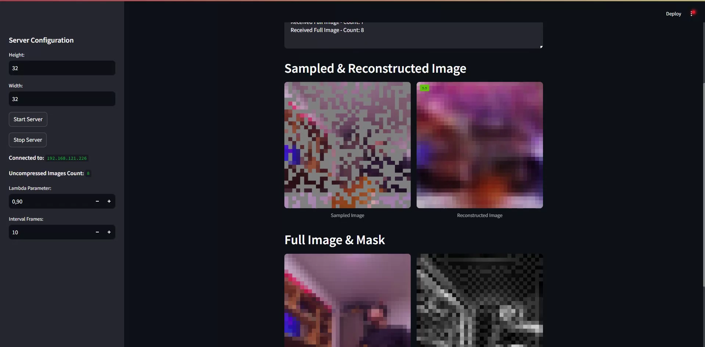

# Drone Image Transmission & Reconstruction

This project implements an image transmission system for a drone, simulated using a **Raspberry Pi**. The system includes:
- **A server-side application** for receiving images and reconstructing them.
- **A client application** to capture and send images from the drone.
- **A Streamlit-based web interface** for visualization and control.

## Features
- **Real-time Image Transmission:** Send images from a Raspberry Pi (or any device) to the server.
- **Image Sampling & Reconstruction:** Uses mask-based sampling for efficient transmission.
- **Web-Based Interface:** Start/stop the server, configure parameters, and visualize images.
- **Flexible Deployment:** Can be tested locally or run on a drone.

## Installation
### Install Dependencies
A `requirements.txt` is provided with all necessary versions, but it includes additional packages from past projects. Install dependencies normally, and if any errors occur, install the required versions manually.

### Run the Server
Start the server using the **Streamlit-based web interface**:
```bash
python server_gui_st.py
```
Then, click **"Start Server"** in the web application.

### Run the Client
You have two options:
- **Run locally for testing:**
  ```bash
  python client.py
  ```
- **Deploy to a Raspberry Pi:**
  1. Transfer the `DroneClient/` folder to the Raspberry Pi.
  2. Navigate to the folder and start the client:
     ```bash
     python client.py
     ```

### Ensure Correct File Placement
To enable image reconstruction and mask generation, ensure the necessary files are in the same directory as the server.

## Usage
- Open the **Streamlit Web Interface** to monitor and configure the transmission.
- The system will display **sampled images, reconstructed images, and full images**.
- Adjust **Lambda Parameter** to adjsut the weight of the contour mask on the generated mask by the model, and **Interval Frames** for then umber of uncompressed images received before sending another mask to the camera.


## Screenshot


## Notes
- The `requirements.txt` contains additional versions from past projects. If installation issues arise, manually install necessary packages.
- Ensure proper network connectivity between the client and server.
- In this project, PyTorch 2.0.0+cu118 was used which corresponds to CUDA version 11.8.

## License
MIT License © 2025 Abdelmouhaimen Sarhane
